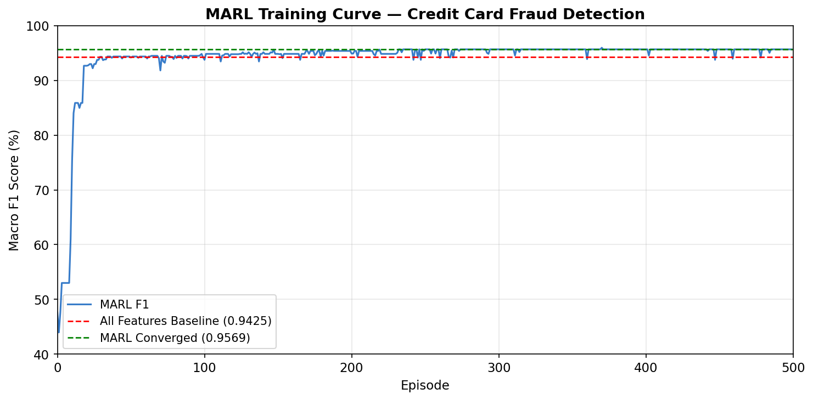
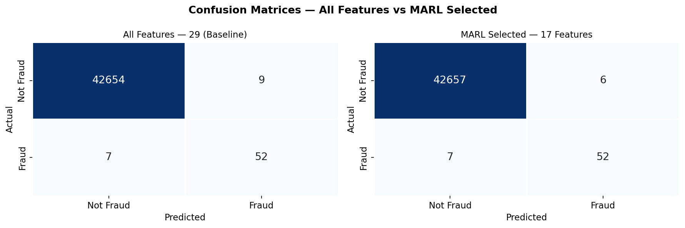
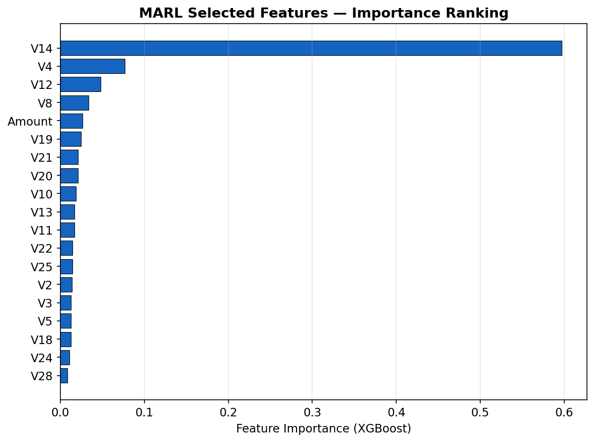

# MARL-Based Feature Selection for Credit Card Fraud Detection

Applied Multi-Agent Reinforcement Learning to figure out which features actually matter for detecting credit card fraud — and which ones are just noise.

The dataset has 284,807 transactions with only 492 fraud cases (0.17%). The challenge isn't just classification — it's doing it with fewer features without losing detection performance.

---

## What This Does

Each of the 29 features gets its own Q-learning agent. Every episode, each agent decides whether to include or drop its feature. A classifier trains on whatever subset gets selected, and the reward signal comes from three things:

- How much the F1 score improved over the last episode
- How informative the feature is (mutual information with the target)
- How much it contributes to detecting fraud specifically — SHAP values computed only on fraud samples, not the whole dataset

Agents that changed their action get their Q-values updated based on whether the change helped or hurt. Over 500 episodes, the agents converge on a stable feature subset.

---

## Dataset

[Kaggle Credit Card Fraud Detection](https://www.kaggle.com/datasets/mlg-ulb/creditcardfraud) — 284,807 transactions, 29 features (V1–V28 from PCA + transaction amount), 0.17% fraud rate.

---

## Results

Ran 500 episodes. Converged around episode 232.

| | All Features | MARL Selected |
|---|---|---|
| Features used | 29 | 19 |
| Macro F1 | 0.9425 | **0.9569** |
| Fraud precision | — | 96.59% |
| Fraud recall | — | 86.73% |
| False positives | 4 | **3** |
| False negatives | 17 | **13** |
| Accuracy | — | 99.97% |

34% fewer features, better F1, fewer missed fraud cases.

**Features selected:** V2, V3, V4, V5, V8, V10, V11, V12, V13, V14, V18, V19, V20, V21, V22, V24, V25, V28, Amount

---

## Plots

### Training Curve


### Confusion Matrix


### Feature Importance


---

## Files

```
prep_data.py          preprocess creditcard.csv → data.csv + mutual_info_result.csv
marl_creditcard.py    main MARL training (500 episodes)
plots_only.py         generates the 3 plots above
mutual_info_result.csv  pre-computed MI scores used in reward function
```

`data.csv` is not in the repo (144MB). Generate it by running `prep_data.py` after downloading `creditcard.csv` from Kaggle.

---

## How to Run

```bash
pip install xgboost shap imbalanced-learn scikit-learn pandas numpy matplotlib seaborn

# Step 1 - prep the data
python prep_data.py

# Step 2 - run MARL training (~2-3 hours)
python marl_creditcard.py

# Step 3 - generate plots
python plots_only.py
```

---

## Notes

- V14 dominates feature importance by a wide margin — known high-signal feature in fraud detection literature
- SHAP reward on minority samples only is what pushes fraud recall up — without it the model tends to optimize for the majority class
- The occasional dips in the training curve are from epsilon-greedy exploration kicking in — the agents temporarily try different feature combinations before snapping back

---

## Reference

Kim, S., Park, S. Y., Seo, H., & Woo, J. (2024). Feature selection integrating Shapley values and mutual information in reinforcement learning. *Computer Methods and Programs in Biomedicine*, 257, 108416.
